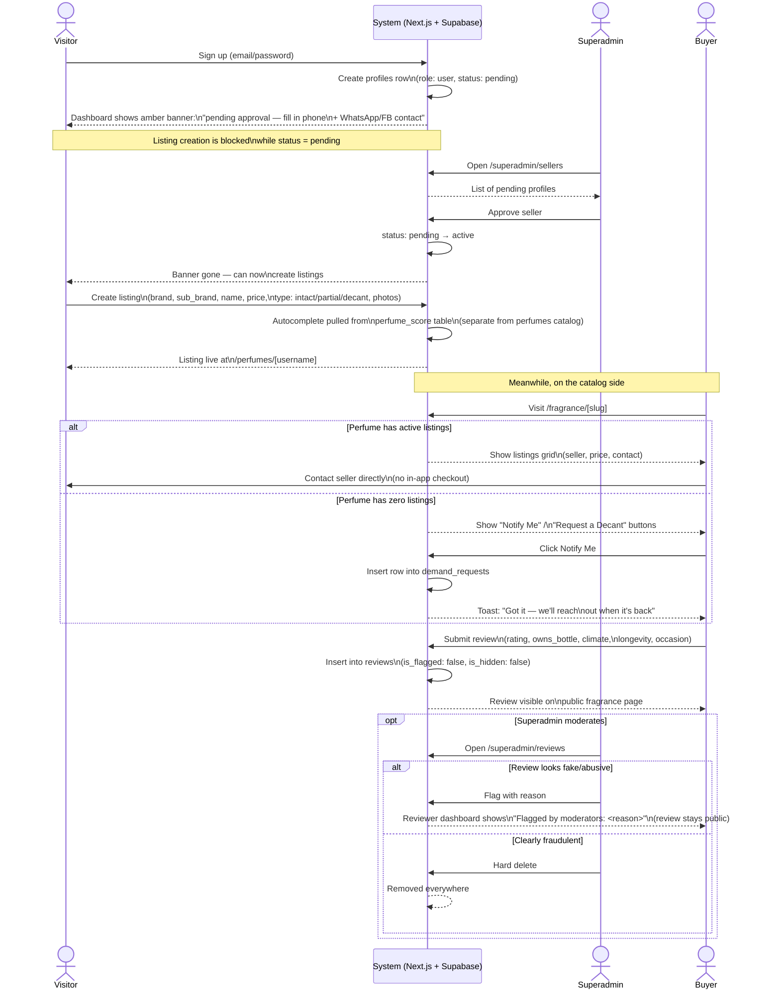
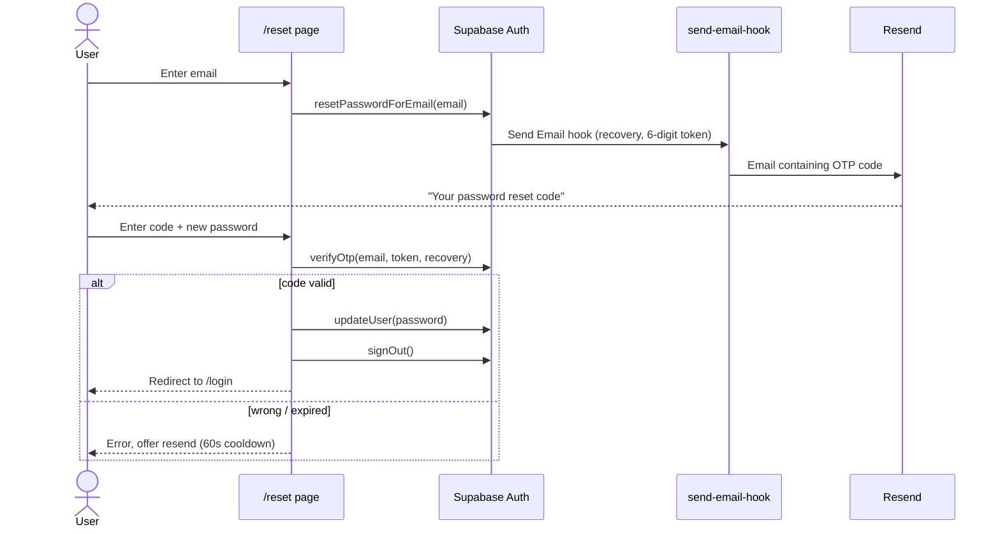

# Cloud Perfume BD — Workflow Diagrams

Source of truth for every user-facing and superadmin-facing workflow on
this platform, in [Mermaid](https://mermaid.js.org/) syntax. Two uses:

1. **Paste the Mermaid block** into the [Mermaid Live Editor](https://mermaid.live)
   or any Mermaid-aware tool (Notion, Obsidian, GitHub markdown itself)
   to render it instantly.
2. **Paste the "Quote for an AI diagram tool"** under each diagram into
   any AI diagramming product (Eraser.io, Whimsical AI, napkin.ai, etc.)
   that takes a plain-English brief instead of Mermaid syntax.

Diagram type is picked per workflow, not fixed — whichever fits the
shape of the thing being described (flowchart for a branching decision
loop, sequence diagram for a multi-actor process over time, state
diagram for an entity's lifecycle, etc.).

**Maintenance rule:** every time a new workflow, role, or decision path
is added to the superadmin panel or the user/seller experience, add it
here — either as a new numbered workflow section, or as a new
branch/step in an existing diagram if it extends one. `CLAUDE.md` points
here so this stays the first place anyone (human or Claude) looks
before touching role/permission/workflow logic.

---

## 1. Superadmin Daily Operations Workflow

**Type: Flowchart.** This is one actor (the superadmin) running a
repeatable decision loop across five panel sections — a flowchart reads
better than a sequence diagram because the "actors" here are really
just decision branches, not back-and-forth messages between parties.

Covers: Sellers, Listings, Reviews, Blog, and Perfumes (full CRUD as of
2026-09-29).

```mermaid
flowchart TD
    Start([Superadmin logs in]) --> Sellers{New seller\nsignups pending?}

    Sellers -- Yes --> SellerReview[Review profile:\nphone + WhatsApp/FB contact filled?]
    SellerReview --> SellerDecision{Legit seller?}
    SellerDecision -- Approve --> SellerActive[status: pending → active\nCan now create listings]
    SellerDecision -- Suspicious --> SellerFlag[status → flagged]
    SellerDecision -- Reject --> SellerBan[status → banned]
    SellerActive --> Listings
    SellerFlag --> Listings
    SellerBan --> Listings
    Sellers -- No --> Listings{Any listings\nto moderate?}

    Listings -- Yes --> ListingCheck{Listing looks fake\nor abusive?}
    ListingCheck -- Yes --> ListingAction[Hide / flag / delete listing]
    ListingCheck -- No --> Reviews
    ListingAction --> Reviews
    Listings -- No --> Reviews{New reviews\nto moderate?}

    Reviews -- Yes --> ReviewCheck{Fake, off-topic,\nor abusive?}
    ReviewCheck -- Yes, with reason --> ReviewFlag[Flag review + reason\nreviewer sees it on their dashboard]
    ReviewCheck -- Clearly fraudulent --> ReviewDelete[Hard delete review]
    ReviewCheck -- No, just negative --> ReviewKeep[Leave as-is —\nnegative-but-real is the trust asset]
    ReviewFlag --> Demand
    ReviewDelete --> Demand
    ReviewKeep --> Demand
    Reviews -- No --> Demand{Check demand_requests:\nwhat are people\nasking to be notified about?}

    Demand --> Perfumes{Catalog gap?\nnew perfume needed,\nor existing page\nneeds real content?}

    Perfumes -- Need new page --> PerfumeCreate["/superadmin/perfumes →\nAdd new perfume\n(brand, name required;\nslug auto-generated)"]
    Perfumes -- Fix existing page --> PerfumeEdit[Edit notes, accords,\nhouse description,\nSEO meta fields]
    Perfumes -- Add fake-spotting guide --> PerfumeVerify[Fill batch code /\npackaging notes →\nSave & Verify]
    Perfumes -- Duplicate/bad entry --> PerfumeDelete{Any listings\nreference it?}
    PerfumeDelete -- Yes --> PerfumeBlocked[Delete blocked —\nreassign/remove listings first]
    PerfumeDelete -- No --> PerfumeGone[Deleted —\nprice history + demand\nrequests cascade-delete;\nreviews keep, perfume_id set null]

    PerfumeCreate --> Blog
    PerfumeEdit --> Blog
    PerfumeVerify --> Blog
    PerfumeBlocked --> Blog
    PerfumeGone --> Blog

    Blog{Blog posts\nawaiting review?}
    Blog -- Yes --> BlogDecision{Publish or reject?}
    BlogDecision -- Publish --> BlogPublish[status → published]
    BlogDecision -- Reject --> BlogReject[status → rejected + reason]
    Blog -- No --> Social

    BlogPublish --> Social
    BlogReject --> Social

    Social[Post as "Cloud Perfume Team"\non FB/IG — never as a fake\nregular user] --> Done([Done for today])
```

**Quote for an AI diagram tool:**

> Draw a flowchart titled "Superadmin Daily Operations Workflow" with
> one start node "Superadmin logs in" and one end node "Done for
> today." It's a single-actor decision loop through six sections in
> order: Sellers, Listings, Reviews, Demand Requests, Perfumes, Blog,
> then a final "post on social media as the brand, never as a fake
> user" step before Done. For Sellers: decision "new signups pending?"
> → if yes, review profile completeness → decision "legit seller?" with
> three branches: Approve (status becomes active, can now create
> listings), Flag (suspicious), Reject (banned) — all three rejoin the
> flow. For Listings: decision "any to moderate?" → if yes, decision
> "fake or abusive?" → yes leads to hide/flag/delete, no continues. For
> Reviews: decision "new reviews?" → if yes, decision "fake, off-topic,
> or abusive?" with three outcomes: flag with a reason (visible to the
> reviewer), hard delete (only for clear fraud), or leave alone
> (explicitly note: negative-but-real reviews are kept, not flagged).
> For Demand Requests: single step "check what perfumes people are
> asking to be notified about." For Perfumes: decision "catalog gap?"
> with four branches: create a new perfume page (brand + name required,
> slug auto-generated), edit an existing page's content, verify it by
> filling in a fake-spotting authenticity guide, or delete a duplicate
> — the delete branch has its own sub-decision "any listings still
> reference it?" where yes blocks deletion and no proceeds (and
> deleting cascades to price history and demand requests, while
> reviews are kept with their perfume link cleared). For Blog: decision
> "posts awaiting review?" → publish or reject with a reason. Use
> diamond shapes for every decision point and rectangles for actions.

---

## 2. User → Seller Journey (Signup to Sale)

**Type: Sequence diagram.** This workflow is genuinely multi-actor and
time-ordered — a Visitor, the System, the Superadmin, and a Buyer each
take turns — so a sequence diagram is the right shape, not a flowchart.

Key fact this diagram encodes: **"seller" is not a separate account
role.** Every account starts as `role: user`. Becoming a seller is a
`profiles.status` transition (`pending → active`) approved by a
superadmin — there is no third role in the system.



**Quote for an AI diagram tool:**

> Draw a sequence diagram titled "User → Seller Journey (Signup to
> Sale)" with four lanes: Visitor, System (Next.js + Supabase), Superadmin,
> Buyer. Sequence: Visitor signs up → System creates a profile row with
> role "user" and status "pending" → System shows Visitor a banner
> saying they're pending approval and listing creation is blocked. Then
> Superadmin opens the sellers admin page, sees the pending profile, and
> approves it → System changes status from pending to active → the
> banner disappears for the Visitor, who can now create listings. The
> Visitor then creates a listing (brand, sub-brand, name, price, listing
> type of intact/partial/decant, photos) — note that the brand/name
> autocomplete pulls from a separate table called perfume_score, not
> the main perfume catalog table — and the listing goes live on their
> public profile page. In parallel, a Buyer visits a perfume's catalog
> page. Branch: if that perfume has active listings, show the listings
> grid and the buyer contacts the seller directly outside the app (no
> in-app checkout exists). If it has zero listings, show "Notify Me" and
> "Request a Decant" buttons instead; when clicked, the System inserts a
> row into a demand_requests table and shows a confirmation toast. After
> that, the Buyer submits a review (rating, whether they own the bottle,
> climate performance, longevity, occasion) which the System stores and
> immediately shows on the public page. Finally, show an optional
> moderation branch: the Superadmin opens the reviews admin page, and
> either flags a suspicious review with a reason (which becomes visible
> on the reviewer's own dashboard, but the review stays visible to the
> public) or hard-deletes a clearly fraudulent one (removed everywhere).
> Use dashed return arrows for system responses and solid arrows for
> actions/requests, with alt/opt blocks for the branching parts.

---

## 3. Password Reset (Email OTP)



Code (not link) is used because email link-scanners consume single-use links before the user clicks.

---

## Workflow Changelog

| Date | What changed | Diagram(s) affected |
|---|---|---|
| 2026-09-29 | Initial two workflows written: Superadmin Daily Operations (flowchart), User → Seller Journey (sequence diagram) | Both |
| 2026-10-04 | Password reset switched from emailed link to emailed 6-digit OTP entered on /reset | Section 3 (new) |
| 2026-10-05 | Navbar for admins: "Panel" link to /superadmin replaces Dashboard + profile chip | Section 1 (entry point) |

**When adding a new workflow, role, or decision branch:** add a row here
with the date and a one-line description, then either extend the
relevant diagram above (new branch/step) or add a new numbered section
with its own diagram + AI-tool quote, following the same format.
